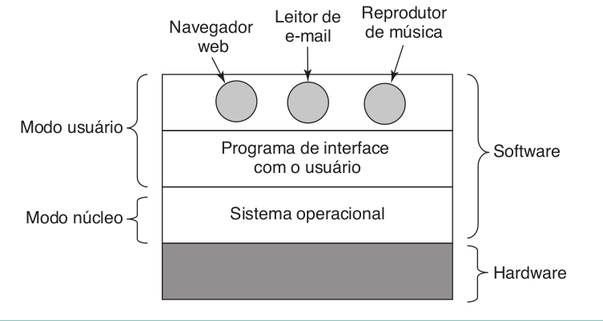
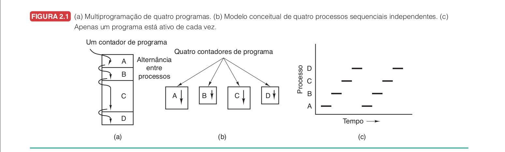
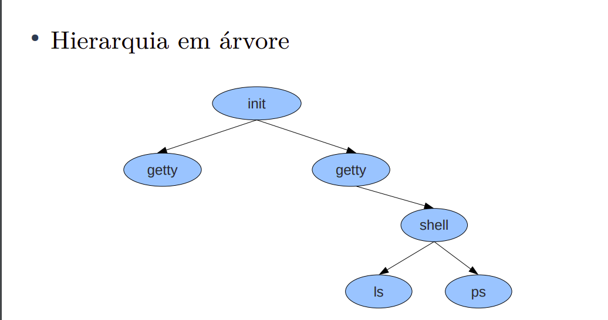
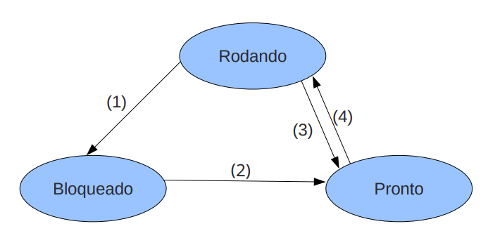
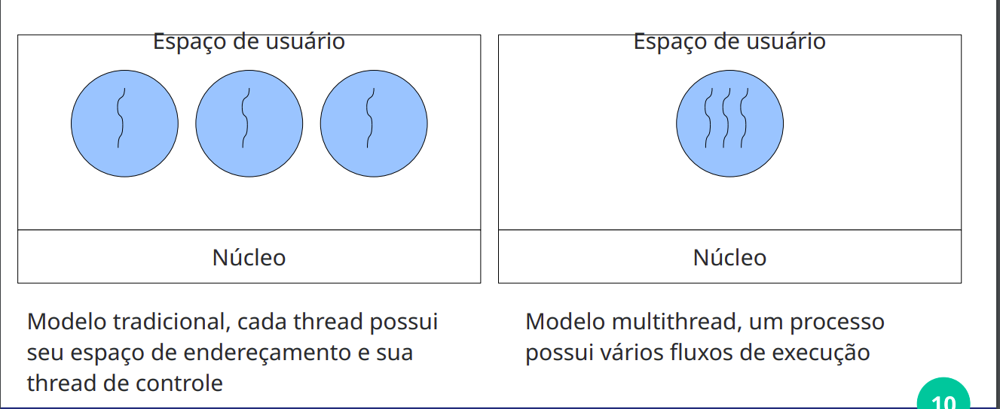
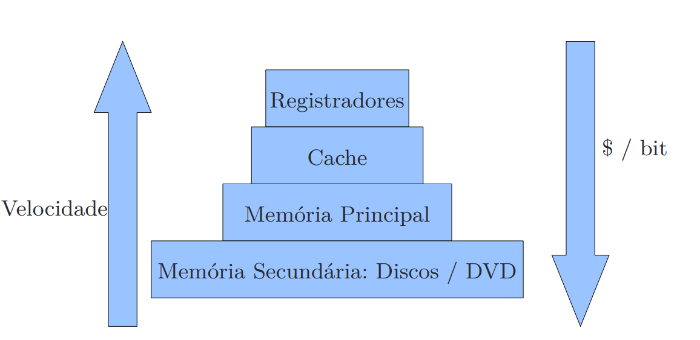

# FUNDAMENTOS DE SISTEMAS OPERACIONAIS

Bibliografias:
- SISTEMAS OPERACIONAIS MODERNOS 4ª EDIÇÃO
    - Autor: TANENBAUM, A.S. Obra: Sistemas Operacionais Modernos Editor: Pearson Edição: 3ª Ano:
2010
- Slides do professor
    - Módulo 02 - Processos, Prof. Daniel Sundfeld

Capítulos (Tanenbaum):
1. Introdução
2. Processos e Threads

Slides:
1. Nocoes de SO
2. Processos
3. Threads

## #1 INTRODUÇÃO

**Sistema Operacional:**
- É um programa ou conjunto de programas.
- Fornece aos programas do usuário um modelo um modelo do computador melhor, mais simples e mais limpo.
- O Sistema Operacional opera em modo protegido (ou núcleo).



- Modo Protegido:
    - Nesse modo há um acesso completo ao hardawre, sendo capaz de executar toda e qualquer intrução que a máquina for capaz.
- Modo Usuário:
    - Apenas um subconjunto das instruções da máquina está disponível.

**Definição de Sistema Operacional**
- O SO é a parte fundamental de software que
executa em modo protegido.
- Machado & Maia: A grande diferença entre um sistema
operacional e aplicações convencionais é a maneira como
suas rotinas são executadas em função do tempo.???
- Suas rotinas são executadas concorrentemente em
função de eventos assíncronos (que podem ocorrer a
qualquer momento).

**Qual a função de um Sistema Operacional**

Um SO tem, essencialmente duas funções:

1. Máquina extendida:
- detalhar
2. Gerenciador de Recursos.
- detalhar

INCOMPLETO

## #2 PROCESSOS

**Definição de Processo**
- É uma instância de um programa em execução.
- Inclui tanto o código executável quanto o contexto de execução associado a ele, como os registros do processador, a pilha de execução, o espaço de endereçamento e outros recursos necessários para a execução do programa.
- Em um instante qualquer, a CPU está executa **apenas um** processo, no curso de 1s ela pode trabalhar em vários deles (pseudoparalelismo).
- A CPU real está constantemente trocando de processo.
- Chama-se esse mecanismo de trocas rápidas de multiprogramação.



- Processos não devem ser
programados com suposições predefinidas sobre a
temporização.

Por analogia, um programa pode ser visto como uma receita de bolo enquanto o bolo em si seria o processo. Podem existir vários processos para um mesmo programa.

A ideia fundamental é que um processo é uma atividade de algum tipo. Ela tem um programa, uma entrada, uma saída e um estado.

### Informações sobre um processo

Um processo possui:
- Ambiente: Espaço de Endereçamento + Contexto de Software
    - Espaço de endereçamento.
    - Arquivos abertos.
    - Processos filhos.
    - Sinais.
    - Estatísticas de uso.
- Execução: Contexto de Hardware
    - Contador de programa (PC).
    - Apontador de pilha.
    - Conjunto de Registradores.
    - Estado de Execução.

### Classificação dos modelos de processos

- Heavyweight (processo tradicional):
    - Possuem ambiente e execução.
    - Troca de contexto cara.
- Lightweight (threads):
    - Devem estar dentro de um processo, possuindo apenas um ambiente.
    - Possuem apenas execução.
    - Compartilham os recursos do processo, gerenciar isso é dever do programador.
        - Uma thread não deve atrapalhar a outra.
    - Troca de contexto barata.

### Criação de processos

Quatro eventos principais levam a criação de processos:
1. Inicialização do Sistema
2. Execução de uma chamada de sistema de criação.
3. Solicitação de um usuário para criar um novo processo.
4. Início de uma tarefa em lote.

- Quando o SO é carregado, diversos processos são criados:
    - Alguns executam em primeiro plano e interagem com os usuários.
    - Outros executam em segundo plano (**Daemons**)
    - Normalmente os processos são criados por outros processos.

- Hierarquia em árvore:


**UNIX:**

No Unix há apenas uma forma de criar processos: *clonagem*.

```fork();```

- Clone indêntico ao processo que o criou.
- Normalmente, executa execve depois da chamada para mudar o “programa” em execução.

**WINDOWS:**

No Windows, há uma função que trata o processo de criação.

```CreateProcess```

### Término de processos

- Condições de término de processos:
    - Saída normal (voluntária).
    - Saída por erro (voluntária).
    - Erro fatal (involutário).
    - Cancelamento por outro processo(involuntário).

### Hierarquia de processos

- Quando um processo é criado por outro, eles continuam associados.
- Em alguns sistemas, é possível listar o ppid (parent pid).
- Todos os processos são filhos ou descentes do processo init (atualmente, há uma alternativa: systemd)PESQUISAR.
- O Windows não apresenta hierarquia de processos.

### Estados de processos

- Apesar de processos serem autossuficentes, muitas vezes necessitam acessar recursos ou comunicar com outro processo.
- Um processo pode estar em um destes 3 estados:
    1. Rodando:
        - está atualmente sendo executado pela CPU.
    2. Bloqueado: quando está esperando um evento qualquer.
        - leitura em disco.
        - leitura de rede.
        - aguardando uma entrada.
    3. Pronto:
        - não está em execução no momento ou está finalizado.


1. O processo se bloqueia enquanto aguarda uma entrada.
2. A entrada é recebida, então a execução continua.
3. O processador interrompe o processo para executar outro.
4. O processador volta a executar o processo.

Um sistema é dito **monoprocessado** se possui apenas um processo rodando por vez.

### CPU Bound e I/O Bound

Processos podem ser classificados como:
1. CPU Bound: passam a maior parte do tempo usando a CPU, no estado rodando ou no estado pronto.
2. I/O Bound: passam a maior parte do tempo em bloqueado por causarem muitas operações de entrada e saída.

### Tabela de processos

- Cada processo possui um id único chamado pid (process id).
- As informações de um processo estão na **tabela de processos**
- Durante a execução, o processo compartilha o processador com outros processos. 

### Implementação de processos

**Troca de contexto**
- Operação de salvamento dos registradores de um processo e restauração de registradores de outro processo.
- A troca de contexto permite a troca de registrador entre os processos.
- É a operação básica da multiprogramação.
- Exemplo1: um processo p1 está em execução, mas o processador vai agora executar um outro processo p2.
    1. Os "dados" de p1 são salvas e este entra em estado bloqueado.
    2. Os "dados" de p2 são carregados para que sua execução continue.
- Exemplo2:
    1. O processo p1 solicita uma operação.
    2. O SO altera o estado de p1 para bloqueado.
    3. O SO escolhe um dos processos prontos p2 e coloca em execução.
    4. A solicitação de p1 é atendida.
    5. O hardware interrompe a execução de p2, salvando seu estado de execução na pilha.
    6. O hardware acessa um endereço de memória física que contém o **vetor de interrupções**.
    7. A rotina de tratamento de interrupção é executada.
    8. Os registradores que foram empilhados são salvos na tabela de processo do p2.
    9. p1 é colocado na fila de prontos.
    10. O SO acessa a entrada da tabela de processos escolhido e carrega o conteúdo da tabela nos registradores de máquina (**restauração**).
    
### Escalonamento de processos

- O Sistema Operacional é responsável por gerenciar os recursos de processamento de um computador (**escalonamento de processador**).
- Uma vez que muitos processos estão em estado pronto, é preciso escolher qual será executado.
- O algoritmo usado para isso chama-se **algoritmo de escalonamento**
- Isso estabelece uma execução "pseudosimultânea" em que vários processos seriam **aparentemente** executados ao mesmo tempo, aumentando a eficiência na utilização da CPU.
- Escalonadores podem ser:
    1. Preempitivos: permitem que um processo em execução seja interrompido e substituído por outro processo de maior prioridade.
    2. Não-Preemptivos: um processo em execução continua até que termine ou faça uma operação de bloqueio (como esperar por I/O). Nesse tipo de escalonamento, um novo processo só pode ser executado quando o processo atual termina sua execução ou é bloqueado voluntariamente.

### Escalonamento Preemptivo

**Funcionamento**
- Cada processador possui um tempo (time-slice) de posse do processador.
- Quando o tempo se esgota o SO retira o processador deste processo e permite que outro execute. 
- Exemplo: duas crianças dividem o mesmo brinquedo, cada uma tem 5 minutos de posse do brinquedo, passado esse tempo devem dar o brinquedo para a outra usar por 5 minutos.

**Detalhes**
- O controle de tempo é feito por interrupção.
- O SO tem um contador que é decrementado a cada clock tick, quando chega a 0, o tempo do processo acabou.

**Atributos**
- Asseguram uso balanceado da CPU, evitando monopólio de processos.
- Maior complexidade.
- Processos podem ser interrompidos a qualquer momento, logo eles devem proteger suas estruturas de dados contra a interferência de outros processos (**regiões críticas**)

### Critérios de escalonamento

**Justiça**
- Garantia de que todos os processos terão chances justas de uso do processador.

**Eficiência**
- Se existe trabalho a fazer, o processador deve estar ocupado.

**Minimizar tempo de resposta**
- Menor tempo possível entre uma entrada e uma resposta.

**Minimizar tempo de turnaround**
- Reduzir o tempo desde o lançamento do processo até seu término.

**Minimizar waiting time**
- Reduzir tempo de espera da CPU.

**Maximizar throughtput**
- Maior número de tarefas executado em um período de tempo.

## #3 ALGORITMOS DE ESCALONAMENTO

**Algoritmos clássicos de escalonamento**
1. First Come First Served
2. Round Robin
3. Prioridades
4. Shortest Job First

### First Come First Served
O processo que pede a CPU primeiro obtém a CPU em primeiro lugar.

**Características**
- Não-preemptivo.
- Justiça: Não. Um processo pode monopolizar.
- Eficiência: OK. A CPU sempre é utilizada, se existe trabalho.
- Minimizar o tempo de resposta: Não. Caso um processo monopolize.
- Minimizar o turnaround: Tarefas longas sendo executadas primeiro, aumenta turnaround.
- Minimizar waiting time: O tempo de espera não é considerado durante o escalonamento.
- Maximizar throughtput: Se a primeira tarefa for longa, o tempo de término fica alta.

**Vantagens**
- Simples de ser implementado.
- Algoritmo eficiente: a CPU sempre é utilizada.

**Desvantagens**
- Impossibilidade de se prever quando um processo vai iniciar.
- Tempo média de espera de processos não é priorizado.
- Processos que usam muito a CPU levam vantagens sobre processos que causam muito seu bloqueio, falta de justiça.


**Implementção**
1. Processos que solicitam a CPU são colocados em uma fila (FIFO) de prontos.
2. Primeiro processo(p1) da fila é selecionado.
3. p1 entra em execução.
4. A execução continua até p1 causar seu bloqueio.
5. O próximo processo(p2) da fila é selecionado.
6. E assim por diante...

**Exemplo de código em C**
Obs: joguei no chatGPT, talvez não esteja certo
```
#include <stdio.h>

struct Process {
    int pid;        // ID do processo
    int arrival;    // Tempo de chegada
    int burst;      // Tempo de burst (duração)
    int waiting;    // Tempo de espera
    int turnaround; // Tempo de retorno
};

void findWaitingTime(struct Process proc[], int n) {
    int service_time[n];
    service_time[0] = proc[0].arrival;
    proc[0].waiting = 0;

    for (int i = 1; i < n; i++) {
        service_time[i] = service_time[i-1] + proc[i-1].burst;
        proc[i].waiting = service_time[i] - proc[i].arrival;

        if (proc[i].waiting < 0) {
            proc[i].waiting = 0;
        }
    }
}

void findTurnaroundTime(struct Process proc[], int n) {
    for (int i = 0; i < n; i++) {
        proc[i].turnaround = proc[i].burst + proc[i].waiting;
    }
}

void findAvgTime(struct Process proc[], int n) {
    findWaitingTime(proc, n);
    findTurnaroundTime(proc, n);

    int total_waiting = 0, total_turnaround = 0;
    for (int i = 0; i < n; i++) {
        total_waiting += proc[i].waiting;
        total_turnaround += proc[i].turnaround;
        printf("Processo %d: Tempo de espera = %d, Tempo de retorno = %d\n",
               proc[i].pid, proc[i].waiting, proc[i].turnaround);
    }

    printf("Tempo médio de espera = %.2f\n", (float)total_waiting / n);
    printf("Tempo médio de retorno = %.2f\n", (float)total_turnaround / n);
}

void FCFS(struct Process proc[], int n) {
    printf("Ordem de execução dos processos:\n");
    for (int i = 0; i < n; i++) {
        printf("Processo %d -> ", proc[i].pid);
    }
    printf("\n\n");
    
    findAvgTime(proc, n);
}

int main() {
    struct Process proc[] = {
        {1, 0, 8},
        {2, 1, 4},
        {3, 2, 9},
        {4, 3, 5}
    };
    int n = sizeof(proc) / sizeof(proc[0]);

    FCFS(proc, n);

    return 0;
}
```

Tempo de Espera = Tempo de Serviço - Tempo de Chegada

**Exemplo**
| PROCESSO | TEMPO CHEGADA | TEMPO EXECUÇÃO | TEMPO SERVIÇO | TEMPO ESPERA |
|----------|---------------|----------------|---------------|--------------|
| P0       | 0             | 8              | 0             | 0            |
| P1       | 1             | 2              | 8             | 7            |
| P2       | 2             | 5              | 10            | 8            |
| P3       | 3             | 4              | 15            | 12           |


### Round Robin

**Exemplo de código em C (usando vetor)**
```
#include <stdio.h>

typedef struct Process{
    int PID;
    int exec_time;
}Process;

int main(){
    int N, end = 0, finished = 0;
    int cycle_time, run_time = 0;
    scanf("%d", &N);
    Process list[N];
    scanf("%d", &cycle_time);
    for(int i = 0; i < N; i++){
        scanf("%d %d", &list[i].PID, &list[i].exec_time);
        list[i].exec_time *= 1000;
    } 

    int beg = 0;
    while(1){
        for(int i = beg; i < N; i++){
            if(list[i].exec_time > 0){
                if(finished+1 == N){
                    printf("%d (%d)\n", list[i].PID, run_time+list[i].exec_time);
                    return 0;
                }
                else if(list[i].exec_time >= cycle_time){
                    list[i].exec_time -= cycle_time;
                    run_time += cycle_time;
                }else{
                    run_time += list[i].exec_time;
                    list[i].exec_time = 0;
                }
                if(list[i].exec_time == 0){
                    if(i == beg) beg++;
                    printf("%d (%d)\n", list[i].PID, run_time);
                    finished++;
                }
            } 
        }
    }
    return 0;
}
```

### Prioridades
Reconhece que alguns processos são prioritários e devem ser executados antes dos outros.
- A cada processo é atribuída uma prioridade.
- Processos de maior prioridade rodam primeiro.
- As prioridades podem ser atribuídas de duas formas:
    1. Estática:
        - Os processos são divididos em classes com cada classe tendo uma prioridade.
        - Para cada classe/prioridade existe uma fila de prontos.
        
        | PRIORIDADE | (pid)P[0] | (pid)P[1] | (pid)P[2] | (pid)P[3] |
        |------------|-----------|-----------|-----------|-----------|
        | 30         | ---> A    | ---> B    | ---> C    | ---> D    |
        | 20         | ---> G    | ---> H    |           |           |
        | 10         | ---> I    | ---> J    | ---> K    |           |

    2. Dinâmica: 
        - O sistema analisa o comportamento dos processos e atribui prioridades favorecendo um certos comportamentos.
        - Processos I/O devem possuir prioridade alta.
        - **Prioridade dinâmica:** 1/f onde:
            - f é a fração do quantum de tempo usada na última rodada do processo.
        
        **Exemplo**
        - Quantum de tempo = 100u
        - Processo A: Usou 20 unidades de tempo de CPU.
            - f = 20/100 = 0.2
            - Prioridade = 1/0.2 = 5
        - Processo B: Usou 50 unidades de tempo de CPU.
            - f = 50/100 = 0.5
            - Prioridade = 1/0.5 = 2
        - Processo C: Usou 80 unidades de tempo de CPU.
            - f = 80/100 = 0.8
            - Prioridade = 1/0.8 = 1.25

### Shortest Job First
Executa processos de menor tempo de execução primeiro

**Características**
- O tempo total de execução de um processo **deve** ser conhecido.
- Baixo tempo de turnaround.
- Processo interativo:
    - Espera comando.
    - Executa comando

## #4 THREADS

Threads procuram amenizar o problema do alto custo da troca de contexto em processos normais (Heavyweight).

- Contexto = ambiente + execução
- Processos tradicionais:
    - Não compartilham memória.
    - Possuem uma única thread (fluxo) de controle.
    - Agrupam recursos
- Threads (Lightweight):
    - São escalonadas para execução.
    - Permitem que múltiplas **execuções** ocorram em um mesmo **ambiente** (ambiente do processo) com grau de independência entre elas.
    - AKA processos leves.

**Multithread**
- Ambiente com mais de uma thread.

No contexto de threads, um processo é composto por várias threads que
compartilham o ambiente: memória, descritor de
arquivos, entre outros:


Três processos com uma thread vs. um processo com três threads

- Uma thread pode se bloquear à espera de um recurso. Nesse momento uma outra thread poderia passar a executar.
- Essa troca de contexto entre threads é mais leve.
- Threads diferentes em um mesmo processo são menos independentes do que processos distintos, pois partilham o mesmo ambiente.
- Threads compartilham as mesmas variáveis globais.
    **Implicações problemáticas**
    - Uma thread pode apagar completamente o que a outra está fazendo.
        - Esta proteção não é garantida pelo SO pois é impossível e desnecessário.
        - Esta proteção **é dever do programador**.
        - São necessários mecanismos de sincronização.
- Cada thread possui sua própria pilha.

### Estados de Threads

O modelo de estados de processos é facilmente
aplicado a estados de thread, logo:

- Uma thread pode estar em um destes 3 estados:
    1. Rodando:
        - está atualmente sendo executada pela CPU.
    2. Bloqueada: quando está esperando um evento qualquer.
        - leitura em disco.
        - leitura de rede.
        - aguardando uma entrada.
    3. Pronta:
        - não está em execução no momento.

### Chamadas de controle

- thread_create: cria uma thread nova, passando uma função como argumento para iniciar a execução:
```
#include <stdio.h>
#include <stdlib.h>
#include <pthread.h>

// Função que será executada pela nova thread
void *print_message_function(void *ptr) {
    char *message = (char *)ptr;
    printf("%s\n", message);
    return NULL;
}

int main() {
    pthread_t thread1;
    const char *message1 = "Hello, World!";
    int result;

    // Cria uma nova thread que executa a função 'print_message_function'
    result = pthread_create(&thread1, NULL, print_message_function, (void *)message1);

    // Espera pela thread terminar
    pthread_join(thread1, NULL);

    return 0;
}
```

- thread_exit: termina a thread em execução:
```
#include <stdio.h>
#include <stdlib.h>
#include <pthread.h>

// Função que será executada pela nova thread
void *print_message_function(void *ptr) {
    char *message = (char *)ptr;
    printf("%s\n", message);

    // Termina a thread explicitamente
    pthread_exit(NULL);
}

int main() {
    pthread_t thread1;
    const char *message1 = "Hello, World!";
    int result;

    // Cria uma nova thread que executa a função 'print_message_function'
    result = pthread_create(&thread1, NULL, print_message_function, (void *)message1);

    // Espera pela thread terminar
    pthread_join(thread1, NULL);

    return 0;
}
```

- thread_yield: permite que a thread desista voluntariamente da cpu:
```
#include <stdio.h>
#include <stdlib.h>
#include <pthread.h>
#include <sched.h> // Necessário para sched_yield

// Função que será executada pelas threads
void *print_numbers(void *ptr) {
    int id = *((int *)ptr);

    for (int i = 0; i < 5; i++) {
        printf("Thread %d: %d\n", id, i);

        // Cede a CPU voluntariamente
        sched_yield();
    }

    return NULL;
}

int main() {
    pthread_t threads[2];
    int thread_ids[2] = {1, 2};
    int result;

    // Cria duas threads
    for (int i = 0; i < 2; i++) {
        result = pthread_create(&threads[i], NULL, print_numbers, (void *)&thread_ids[i]);
    }

    // Espera pelas threads terminarem
    for (int i = 0; i < 2; i++) {
        pthread_join(threads[i], NULL);
    }

    return 0;
}
```

### Execução de threads vs Execução sequencial
**Código sequencial:**
```
func1(){
    printf("oi\n");
}

func2(){
    printf("ola\n");
}

int main(){
    func1();
    func2();
    return 0;
}
```
- Saída = "oi\nola\n"

**Código multithread:**
```
func1(){
    printf("oi\n");
    thread_exit(0);
}

func2(){
    printf("ola\n");
    thread_exit(0);
}

int main(){
    thread_create(func1);
    thread_create(func2);
    thread_exit(0);
}
```
- Difícil prever se a saída será: "oi\nola\n" ou "ola\noi\n".

### Porque usar Threads ao invés de Processos?

- Podemos dividir o programa caso exista muitas chamadas blocantes. Se as chamadas blocantes forem de diversas fontes, melhora-se o tempo.
- Para explorar melhor os recursos da máquina: Os sistemas computacionais com múltiplos processadores são uma realidade hoje.
- Em alguns sistemas, criar uma thread é 100 vezes mais rápido que criar um processo.
- Um modelo de programação mais simples.
- É possível criar um paradigma mais simples ao decompor múltiplas tarefas em diversas threads mais simples.

## #5 MULTIPROGRAMAÇÃO

Programação com Multithread -> Expectativa vs Realidade:


### Implementação de Threads

- Para a implementação das threads, existem diferentes formas para sua implementação.
1. Implementar o modelo de processos e threads a nível de SO
    - O SO deve se tornar responsável por isso.
2. Implementar o modelo de processos heavyweight e simular múltiplas threads através de bibliotecas
3.
4.
5.


- Via de regra, o escalonador do SO é Não-Preemptivo.
- Quando uma thread for perder o controle, ela chama um procedimento do ambiente de execução para selecionar outra thread para executar.
- Cada processo pode ter seu próprio algoritmo de escalonamento.
- Chamadas bloqueantes bloquearão todas as threads.
    - Solução: deve-se usar uma "capa" antes de todas as chamadas blocantes do sistema.